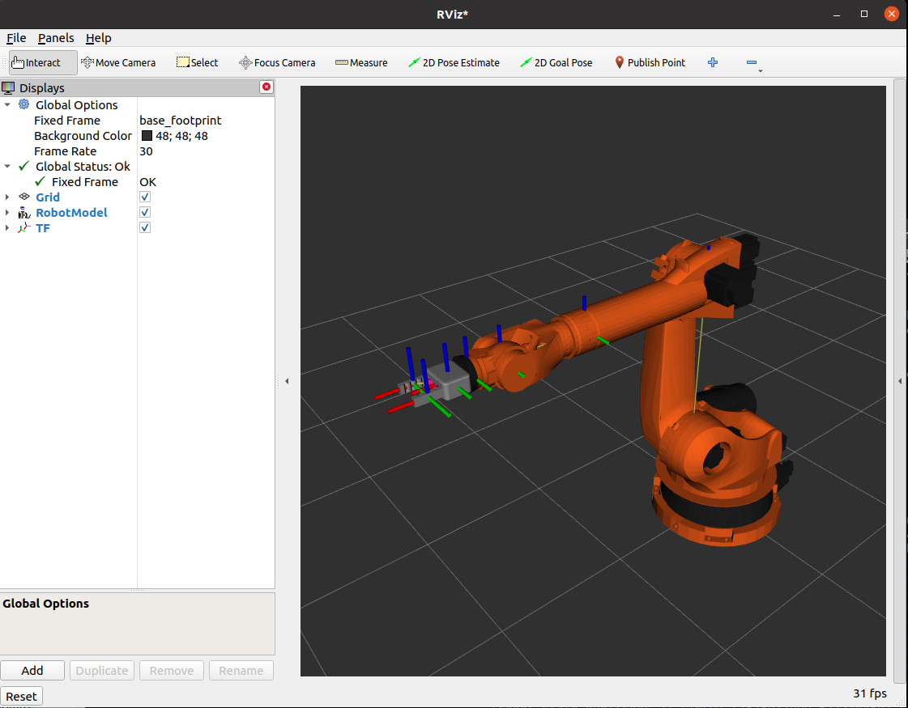
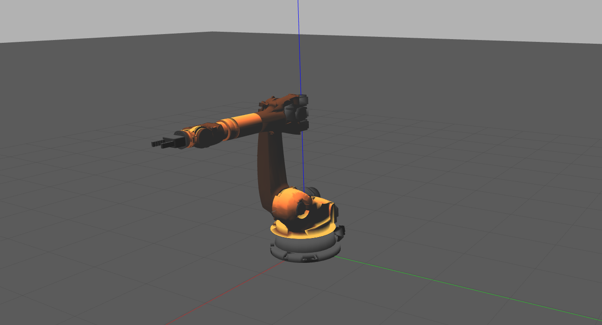
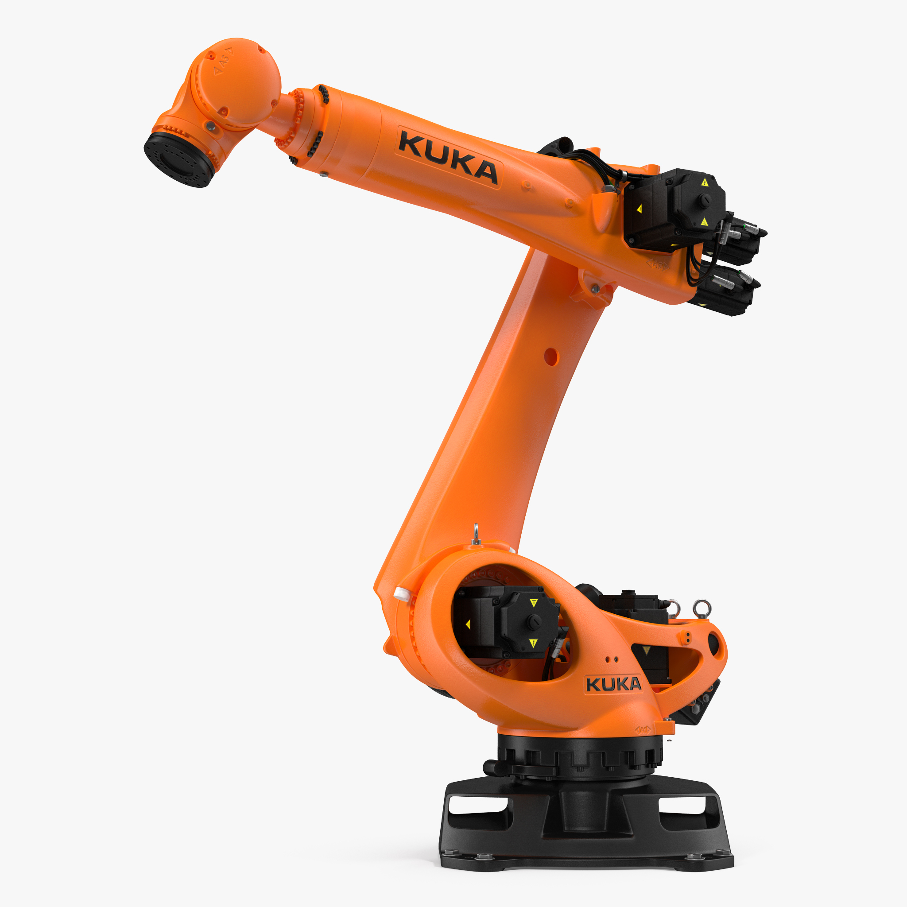

# ROS2 Kuka Kr 210 Manipulator

[](https://opensource.org/licenses/MIT)

# Overview

To build a ROS2 Manipulator simulation that uses forward and inverse kinematics to generate motion paths. 

A KUKA KR210 robot arm is used. It has 6 degrees of freedom. For this project, Position, Effort and Joint Trajectory controllers are taken from the ros_conotrol package.

IKPY python library is used to calculate forward and inverse kinematics solutions with the help of user input.

<p align="center">
  
  <!--  -->
  
</p>


# Dependencies
<ul>
  <li>Ubuntu 20.04</li>
  <li>ROS2 Foxy</li>
  <li>Gazebo</li>
</ul>


# Build and Compile instructions

```
    cd "your_colcon_workspace"/src
    git clone https://github.com/jaisharma10/kuka_kr210_simulation
    cd ..
    colcon build
    source "your_colcon_workspace"/install/setup.bash
```

# General Launch Files

Launch File to import robot into Gazebo

```
  ros2 launch kr210_kuka_manipulator gazebo.launch.py 
```
Launch File to import robot into Rviz
```
  ros2 launch kr210_kuka_manipulator rviz.launch.py 
```

# Running Task Scripts

Start the complete Launch File

```
  ros2 launch kr210_kuka_manipulator control_kr210.launch.py 
```
Call the following run command to - A
```
  ros2 run kr210_kuka_manipulator task_A.py 
```
Call the following run command to - B
```
  ros2 run kr210_kuka_manipulator task_B.py 
```


